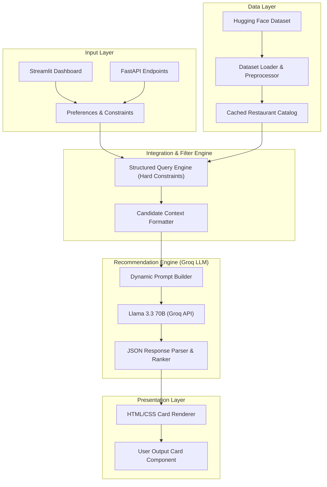

# 🍅 Zomato AI Restaurant Recommender

[](https://www.python.org/)
[](https://streamlit.io/)
[](https://fastapi.tiangolo.com/)
[](https://groq.com/)
[](https://huggingface.co/datasets/ManikaSaini/zomato-restaurant-recommendation)

An AI-powered restaurant recommendation engine inspired by Zomato. This application combines structured, high-performance database filtering on a real-world Zomato dataset with Groq's Large Language Model reasoning (`llama-3.3-70b-versatile`) to curate, rank, and explain personalized dining recommendations.

---

## ✨ Key Features

- **Hybrid Inference Pipeline**: Restricts LLM search space by pre-filtering candidates on hard criteria (location, budget, minimum rating), significantly reducing API costs and latency.
- **Intelligent Constraint Relaxation**: Automatically softens strict filtering criteria (e.g., broadening budget tiers or lowering rating thresholds) if no candidates match, ensuring the user always receives valid suggestions.
- **Premium User Interface**: A custom Zomato-themed dark/warm-red dashboard (`src/main.py`) with card transitions, glassmorphic filters, and interactive visual feedback.
- **Decoupled REST API Backend**: A fully functional FastAPI application (`src/api.py`) exposing clean recommendation and metadata endpoints.
- **Detailed AI Explanations**: Generates tailored, human-like reasoning for each recommended restaurant based on soft user preferences (e.g. cuisine family-friendliness, ambiance, specific dishes).
- **Extensive Test Coverage**: Robust unit and integration tests verifying processing logic, constraint validation, filtering rules, and LLM output parsing.

---

## 📐 Architecture & Workflow

The application employs a layered pipeline architecture to isolate concerns and optimize data flow:



---

## 📂 Project Structure

```text
Zomato-Reccomendation-Engine/
├── docs/                      # Documentation files
│   ├── architecture.md        # Technical details and design architecture
│   ├── context.md             # Project requirements and workflow
│   ├── edge-case.md           # Edge-case strategies and exception flows
│   └── Problemstatement.txt   # Original problem description
├── src/                       # Main application sources
│   ├── data/                  # Data loading, preprocessing, and schemas
│   ├── input/                 # User preference parsing and validation
│   ├── integration/           # Filtering logic and LLM prompt generation
│   ├── engine/                # Groq API provider, response parser, and orchestrator
│   ├── output/                # UI rendering (HTML & CSS templates)
│   ├── api.py                 # FastAPI backend server
│   ├── config.py              # Application settings and environment configuration
│   └── main.py                # Streamlit UI entry point
├── tests/                     # Unit and integration tests
├── requirements.txt           # Python package dependencies
├── .env.example               # Template environment configuration
└── .gitignore                 # Files excluded from git tracking
```

---

## 🛠️ Installation & Setup

### 1. Initialize the Virtual Environment
```bash
python -m venv .venv
# On Windows (PowerShell/CMD)
.venv\Scripts\activate
# On macOS/Linux
source .venv/bin/activate
```

### 2. Install Dependencies
```bash
pip install -r requirements.txt
```

### 3. Configure Environment Variables
Copy `.env.example` to `.env`:
```bash
copy .env.example .env
```
Fill in the configuration parameters inside `.env`:
```ini
GROQ_API_KEY=your_groq_api_key_here
GROQ_MODEL=llama-3.3-70b-versatile
MAX_CANDIDATES=25
TOP_N=5
```

### 4. Verify Configuration
```bash
python -c "from src import config"
```

---

## 🏃 Running the Application

This repository supports two execution modes:

### Streamlit UI (Frontend Dashboard)
To run the Zomato-themed interactive dashboard, set the `PYTHONPATH` and start the Streamlit server:

**On Windows (PowerShell):**
```powershell
$env:PYTHONPATH = "."
streamlit run src/main.py
```

**On macOS/Linux:**
```bash
export PYTHONPATH=.
streamlit run src/main.py
```

### FastAPI Server (Backend REST API)
To start the backend API server (e.g. to connect to a custom decoupled client):
```bash
uvicorn src.api:app --reload
```
You can access the interactive Swagger API documentation at `http://127.0.0.1:8000/docs`.

---

## 🧪 Testing

The codebase includes an extensive suite of tests to verify core logic:
```bash
# Run all tests
pytest

# Run tests with verbose output
pytest -v
```
