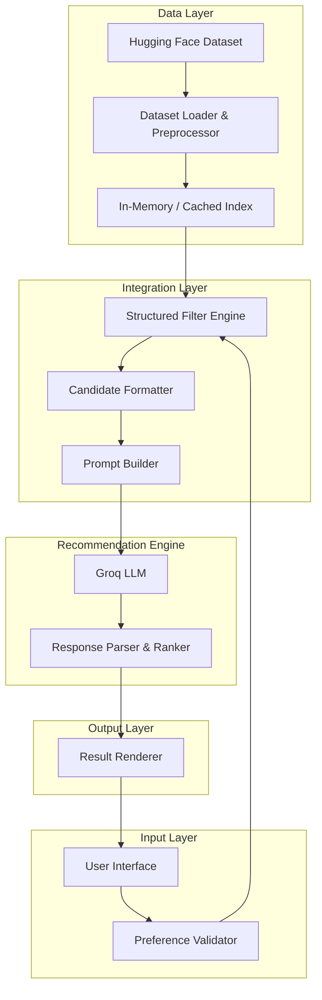
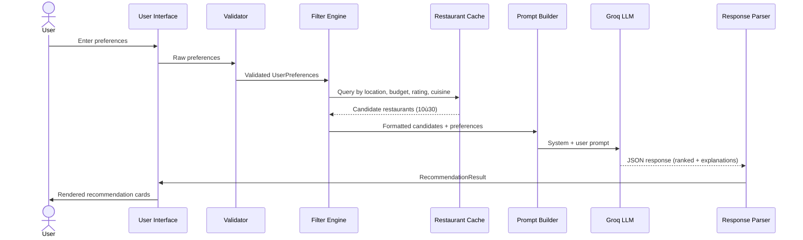

# Architecture: AI-Powered Restaurant Recommendation System

This document describes the technical architecture for the Zomato-inspired restaurant recommendation service defined in [context.md](./context.md). The system combines structured filtering over a real-world dataset with **Groq-hosted LLM** inference for ranking and natural-language explanations.

---

## 1. Architectural Goals

| Goal | Description |
|------|-------------|
| **Accuracy** | Surface restaurants that match hard constraints (location, budget, rating) before LLM reasoning |
| **Personalization** | Use the LLM to rank and explain choices based on soft preferences (cuisine, family-friendly, quick service) |
| **Transparency** | Every recommendation includes a human-readable rationale |
| **Maintainability** | Clear separation between data, filtering, LLM orchestration, and presentation |
| **Cost efficiency** | Pre-filter the dataset so the LLM receives a small, relevant candidate setùnot the full corpus |

---

## 2. High-Level System Architecture

The application follows a **layered pipeline architecture** with five logical stages aligned to the system workflow in context.md.



### Layer Responsibilities

| Layer | Responsibility |
|-------|----------------|
| **Data Layer** | Load, clean, normalize, and cache restaurant records from Hugging Face |
| **Input Layer** | Collect and validate user preferences |
| **Integration Layer** | Apply structured filters, shape candidates for the LLM, construct prompts |
| **Recommendation Engine** | Invoke Groq to rank, explain, and optionally summarize |
| **Output Layer** | Format and display top recommendations to the user |

---

## 3. Component Architecture

### 3.1 Data Ingestion Module

**Purpose:** Load the Zomato dataset and produce a queryable, normalized restaurant catalog.

**Source:** [ManikaSaini/zomato-restaurant-recommendation](https://huggingface.co/datasets/ManikaSaini/zomato-restaurant-recommendation)

```
data/
??? loader.py          # Hugging Face datasets integration
??? preprocessor.py    # Field extraction, type coercion, normalization
??? schema.py          # Restaurant domain model
??? cache.py           # Optional: persist preprocessed data locally
```

**Processing steps:**

1. **Load** ù Fetch dataset via `datasets.load_dataset(...)`.
2. **Extract** ù Map raw columns to canonical fields: `name`, `location`, `cuisine`, `cost`, `rating`.
3. **Normalize**
   - Trim and standardize location strings (e.g., `"Bangalore"` / `"bengaluru"` ? canonical city).
   - Parse cuisine into a list (many records contain comma-separated values).
   - Coerce rating to float; drop or flag invalid entries.
   - Map cost to numeric ranges and budget tiers (`low`, `medium`, `high`).
4. **Index** ù Build in-memory structures for fast filtering (e.g., dict keyed by city, or pandas DataFrame).
5. **Cache** ù Optionally serialize preprocessed output to avoid repeated downloads at startup.

**Restaurant domain model:**

```python
@dataclass
class Restaurant:
    id: str
    name: str
    location: str           # City / locality
    cuisines: list[str]     # e.g., ["Italian", "Continental"]
    cost_for_two: int       # Estimated cost (INR or dataset unit)
    budget_tier: str        # "low" | "medium" | "high"
    rating: float           # e.g., 4.2
    raw_metadata: dict      # Optional extra fields from dataset
```

**Budget tier mapping (example):**

| Tier | Cost for Two (INR) |
|------|---------------------|
| Low | ? 500 |
| Medium | 501 ù 1500 |
| High | > 1500 |

> Adjust thresholds after inspecting actual dataset distribution during implementation.

---

### 3.2 User Input Module

**Purpose:** Capture and validate user preferences before they reach the filter engine.

**Collected preferences (from context.md):**

| Field | Type | Required | Example |
|-------|------|----------|---------|
| `location` | string | Yes | `"Delhi"`, `"Bangalore"` |
| `budget` | enum | Yes | `"low"`, `"medium"`, `"high"` |
| `cuisine` | string or list | No | `"Italian"`, `"Chinese"` |
| `min_rating` | float | No | `4.0` |
| `additional_preferences` | string | No | `"family-friendly, quick service"` |

**Validation rules:**

- Location must match at least one city present in the dataset (fuzzy match optional).
- Budget must be one of the three enum values.
- `min_rating` must be in `[0.0, 5.0]`.
- Empty optional fields are treated as "no constraint."

**Preference domain model:**

```python
@dataclass
class UserPreferences:
    location: str
    budget: str
    cuisine: str | None = None
    min_rating: float | None = None
    additional_preferences: str | None = None
```

**UI options:**

| Option | Best For |
|--------|----------|
| **Streamlit / Gradio** | Rapid prototype, demo, hackathon |
| **FastAPI + React** | Production-style separation of frontend and backend |
| **CLI** | Testing and automation |

For an initial build, **Streamlit** or **Gradio** is recommended to minimize frontend overhead while satisfying the "displays clear and useful results" objective.

---

### 3.3 Integration Layer

**Purpose:** Bridge structured data and the LLM. This is the core orchestration layer.

#### 3.3.1 Structured Filter Engine

Applies **hard filters** before any LLM call to reduce token usage and improve relevance.

**Filter logic (applied in order):**

```
1. location == user.location          (exact or normalized match)
2. budget_tier == user.budget         (or compatible tier)
3. rating >= user.min_rating          (if provided)
4. cuisine contains user.cuisine      (if provided, case-insensitive)
```

**Output:** A candidate list of `Restaurant` objects (target: 10ù30 records). If fewer than 3 candidates remain, relax constraints in order: cuisine ? budget ? min_rating, and note relaxations in the prompt.

#### 3.3.2 Candidate Formatter

Converts filtered restaurants into a compact JSON or markdown table suitable for the LLM context window.

**Example formatted payload:**

```json
[
  {
    "id": "r_001",
    "name": "Trattoria Roma",
    "cuisines": ["Italian", "Continental"],
    "rating": 4.5,
    "cost_for_two": 1200,
    "budget_tier": "medium"
  }
]
```

#### 3.3.3 Prompt Builder

Constructs a structured prompt with:

- **System message** ù Role, output format, constraints.
- **User message** ù User preferences + candidate list.

See [Section 6: LLM Prompt Design](#6-llm-prompt-design) for the full template.

---

### 3.4 Recommendation Engine

**Purpose:** Use **Groq** to rank candidates, generate explanations, and optionally produce a summary.

#### 3.4.1 Groq LLM Integration

This project uses [Groq](https://console.groq.com/) as its LLM provider. Groq delivers fast inference via an OpenAI-compatible chat completions API, which keeps latency low for interactive recommendations.

**SDK:** `groq` (`pip install groq`)

**Recommended models:**

| Model | Use Case |
|-------|----------|
| `llama-3.3-70b-versatile` | **Default** ù strong reasoning for ranking and explanations |
| `llama-3.1-8b-instant` | Faster, lighter option for local dev and testing |

Define a thin wrapper behind a protocol so the recommender stays decoupled from Groq-specific details (e.g., for unit tests with a mock provider):

```python
from groq import Groq

class LLMProvider(Protocol):
    def generate(self, system_prompt: str, user_prompt: str) -> str: ...

class GroqLLMProvider:
    def __init__(self, api_key: str, model: str = "llama-3.3-70b-versatile"):
        self.client = Groq(api_key=api_key)
        self.model = model

    def generate(self, system_prompt: str, user_prompt: str) -> str:
        response = self.client.chat.completions.create(
            model=self.model,
            messages=[
                {"role": "system", "content": system_prompt},
                {"role": "user", "content": user_prompt},
            ],
            response_format={"type": "json_object"},
            temperature=0.3,
        )
        return response.choices[0].message.content
```

**Groq-specific notes:**

- Set `response_format={"type": "json_object"}` to enforce structured JSON output for reliable parsing.
- Store the API key in `GROQ_API_KEY` (never commit to version control).
- Groq enforces rate limits; handle `429` responses with exponential backoff or surface a user-friendly retry message.

#### 3.4.2 LLM Responsibilities

1. **Rank** ù Order candidates by fit to user preferences (especially soft preferences).
2. **Explain** ù Provide 1ù2 sentence rationale per restaurant.
3. **Summarize** (optional) ù Brief overview of the recommendation set.

#### 3.4.3 Response Parser

The LLM should return **structured JSON** (via prompt instructions or JSON mode). The parser:

- Validates schema against expected output.
- Maps LLM restaurant IDs back to full `Restaurant` records.
- Handles malformed responses with a fallback (e.g., return top-N filtered results with a generic explanation).

**Recommendation output model:**

```python
@dataclass
class Recommendation:
    restaurant: Restaurant
    rank: int
    explanation: str

@dataclass
class RecommendationResult:
    recommendations: list[Recommendation]
    summary: str | None
    filters_relaxed: list[str]   # e.g., ["cuisine"]
```

---

### 3.5 Output Display Module

**Purpose:** Present top recommendations in a user-friendly format.

**Per-recommendation fields (from context.md):**

| Field | Source |
|-------|--------|
| Restaurant Name | Dataset |
| Cuisine | Dataset |
| Rating | Dataset |
| Estimated Cost | Dataset (`cost_for_two`) |
| AI-generated explanation | LLM |

**Display layout (example):**

```
???????????????????????????????????????????????????????
?  ???  Top Recommendations for Delhi ù Medium Budget ?
???????????????????????????????????????????????????????
?  #1  Trattoria Roma                                 ?
?      Italian ù ? 4.5 ù ?1,200 for two               ?
?      "Great fit for Italian lovers with a solid      ?
?       rating and mid-range pricing."                ?
???????????????????????????????????????????????????????
?  #2  ...                                            ?
???????????????????????????????????????????????????????
```

Optional enhancements: sort controls, "why these?" summary block, empty-state messaging when no matches are found.

---

## 4. End-to-End Data Flow



**Typical request lifecycle:**

1. User submits preferences via UI.
2. Validator normalizes and validates input.
3. Filter engine queries cached dataset ? candidate list.
4. Prompt builder assembles LLM prompt with candidates and preferences.
5. LLM ranks and explains top choices.
6. Parser validates and enriches LLM output with full restaurant data.
7. UI renders recommendation cards.

---

## 5. Proposed Project Structure

```
restaurant-recommender/
??? docs/
?   ??? context.md
?   ??? architecture.md
?   ??? Problemstatement.txt
??? src/
?   ??? __init__.py
?   ??? main.py                 # App entry point (Streamlit / FastAPI)
?   ??? config.py               # Env vars, model config, budget thresholds
?   ??? data/
?   ?   ??? loader.py
?   ?   ??? preprocessor.py
?   ?   ??? schema.py
?   ??? input/
?   ?   ??? preferences.py
?   ?   ??? validator.py
?   ??? integration/
?   ?   ??? filter.py
?   ?   ??? formatter.py
?   ?   ??? prompt_builder.py
?   ??? engine/
?   ?   ??? groq_provider.py    # Groq LLM client wrapper
?   ?   ??? parser.py
?   ?   ??? recommender.py      # Orchestrates filter ? prompt ? LLM ? parse
?   ??? output/
?       ??? renderer.py
??? tests/
?   ??? test_filter.py
?   ??? test_validator.py
?   ??? test_parser.py
??? requirements.txt            # groq, datasets, streamlit, etc.
??? .env.example                # GROQ_API_KEY (never commit .env)
??? README.md
```

---

## 6. LLM Prompt Design

### 6.1 System Prompt (template)

```
You are a restaurant recommendation assistant for an app similar to Zomato.
You receive a user's dining preferences and a list of candidate restaurants
(already filtered by location, budget, and rating).

Your tasks:
1. Rank the top 5 restaurants that best match the user's preferences.
2. For each, write a concise explanation (1ù2 sentences) of why it fits.
3. Optionally provide a one-sentence summary of the overall selection.

Consider soft preferences (cuisine taste, family-friendly, quick service)
when ranking. Do not invent restaurantsùonly use IDs from the candidate list.

Respond ONLY with valid JSON in this schema:
{
  "summary": "string or null",
  "recommendations": [
    {
      "restaurant_id": "string",
      "rank": 1,
      "explanation": "string"
    }
  ]
}
```

### 6.2 User Prompt (template)

```
User preferences:
- Location: {location}
- Budget: {budget}
- Cuisine: {cuisine or "any"}
- Minimum rating: {min_rating or "none"}
- Additional preferences: {additional_preferences or "none"}

Candidate restaurants:
{candidates_json}
```

### 6.3 Prompt design principles

- **Ground the LLM** ù Always pass explicit candidate IDs; forbid hallucinated restaurants.
- **Separate hard vs soft constraints** ù Hard filters run in code; soft preferences guide LLM ranking.
- **Structured output** ù Use Groq's `response_format={"type": "json_object"}` plus explicit JSON schema in the system prompt for reliable parsing.
- **Token budget** ù Cap candidates at ~30 records; use compact JSON (no pretty-print in production).

---

## 7. API Design (Optional ù FastAPI Backend)

If the frontend is decoupled, expose a single recommendation endpoint.

### `POST /api/v1/recommendations`

**Request body:**

```json
{
  "location": "Bangalore",
  "budget": "medium",
  "cuisine": "Italian",
  "min_rating": 4.0,
  "additional_preferences": "family-friendly"
}
```

**Response body:**

```json
{
  "summary": "These Italian spots in Bangalore offer strong ratings within a medium budget.",
  "recommendations": [
    {
      "rank": 1,
      "name": "Trattoria Roma",
      "cuisine": ["Italian", "Continental"],
      "rating": 4.5,
      "estimated_cost": 1200,
      "explanation": "Highly rated Italian restaurant well within your medium budget."
    }
  ],
  "filters_relaxed": []
}
```

**Error responses:**

| Status | Condition |
|--------|-----------|
| `400` | Invalid preferences (bad budget enum, rating out of range) |
| `404` | No restaurants found even after relaxed filtering |
| `502` | Groq API failure |
| `500` | Unexpected internal error |

---

## 8. Configuration & Environment

| Variable | Description | Example |
|----------|-------------|---------|
| `GROQ_API_KEY` | Groq API key | `gsk_...` |
| `GROQ_MODEL` | Groq model identifier | `llama-3.3-70b-versatile` |
| `MAX_CANDIDATES` | Max restaurants sent to Groq | `25` |
| `TOP_N` | Recommendations returned to user | `5` |
| `DATASET_CACHE_PATH` | Optional local cache file | `./data/cache.parquet` |

Load secrets from environment variables or a `.env` file (excluded from version control).

---

## 9. Error Handling & Edge Cases

| Scenario | Strategy |
|----------|----------|
| **No matches after hard filters** | Progressively relax constraints; inform user which filters were relaxed |
| **Groq timeout or API error** | Return top-N candidates from structured filter with a static fallback explanation |
| **Malformed LLM JSON** | Retry once with a "fix your JSON" follow-up; else fallback |
| **Unknown location** | Suggest closest valid cities from dataset |
| **Empty optional fields** | Treat as unconstrained; do not send `"none"` as a filter value in code |
| **Dataset load failure** | Fail fast at startup with clear error; use cached copy if available |

---

## 10. Non-Functional Requirements

| Requirement | Target |
|-------------|--------|
| **Latency** | < 5 s end-to-end (Groq's fast inference keeps LLM latency low) |
| **Availability** | Graceful degradation when Groq API is unavailable |
| **Scalability** | Dataset loaded once at startup; stateless request handling |
| **Security** | API keys in env only; no PII stored |
| **Testability** | Mock `GroqLLMProvider` for unit tests; fixture dataset subset |

---

## 11. Testing Strategy

| Layer | Test Focus |
|-------|------------|
| **Preprocessor** | Field mapping, budget tier assignment, invalid row handling |
| **Validator** | Enum validation, rating bounds, required fields |
| **Filter engine** | Correct narrowing by location/budget/rating/cuisine; relaxation logic |
| **Prompt builder** | Prompt contains all preference fields and candidate IDs |
| **Parser** | Valid JSON parsing; ID lookup; malformed response fallback |
| **Integration** | End-to-end with mocked Groq provider returning fixed JSON |
| **UI** | Manual smoke test: submit preferences ? verify card output |

---

## 12. Deployment Options

| Environment | Stack | Notes |
|-------------|-------|-------|
| **Local dev** | Streamlit + `.env` | Fastest path to demo |
| **Cloud demo** | Streamlit Community Cloud / Hugging Face Spaces | Free hosting for prototypes |
| **Production** | FastAPI on Docker + React frontend | Separate scaling of API and UI |

**Startup sequence:**

1. Load environment config.
2. Download or load cached dataset.
3. Preprocess and index restaurants.
4. Initialize Groq client (`GroqLLMProvider`).
5. Start web server / UI.

---

## 13. Future Extensions

These are out of scope for v1 but align with the architecture:

- **Vector search** ù Embed restaurant descriptions for semantic cuisine/preference matching.
- **User history** ù Persist past searches to personalize future recommendations.
- **Multi-turn chat** ù Refine recommendations through conversational follow-ups.
- **Geolocation** ù Filter by distance using lat/long if available in dataset.
- **A/B testing** ù Compare prompt variants and ranking strategies.
- **Observability** ù Log prompt/response pairs (redacted) for quality monitoring.

---

## 14. Architecture Decision Summary

| Decision | Choice | Rationale |
|----------|--------|-----------|
| Architecture style | Layered pipeline | Maps directly to the 5-stage workflow in context.md |
| Pre-filter before LLM | Yes | Reduces cost, latency, and hallucination risk |
| LLM role | Rank + explain (not search) | Groq handles soft preferences; code handles hard constraints |
| LLM provider | **Groq** | Fast inference, OpenAI-compatible API, cost-effective for demos |
| Groq model | `llama-3.3-70b-versatile` | Strong reasoning for ranking and explanations |
| Output format | Structured JSON (`json_object` mode) | Reliable parsing and UI binding |
| Initial UI | Streamlit or Gradio | Fast to build; meets display requirements |
| Data source | Hugging Face Zomato dataset | As specified in context.md |
| Provider abstraction | Protocol + `GroqLLMProvider` | Keeps recommender testable with mock implementations |

---

## 15. References

- [context.md](./context.md) ù Project requirements and workflow
- [Zomato Restaurant Dataset (Hugging Face)](https://huggingface.co/datasets/ManikaSaini/zomato-restaurant-recommendation)
- [Groq Console](https://console.groq.com/) ù API keys and model availability
- [Groq Python SDK](https://github.com/groq/groq-python) ù Official `groq` client library
