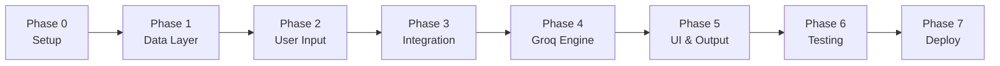

# Phase-Wise Implementation Plan

AI-Powered Restaurant Recommendation System (Zomato Use Case)

This plan translates the requirements in [context.md](./context.md) and the design in [architecture.md](./architecture.md) into a sequential, phase-by-phase build guide. Each phase has clear tasks, deliverables, and acceptance criteria before moving to the next.

---

## Overview

| Item | Detail |
|------|--------|
| **Goal** | Build a restaurant recommender that filters structured Zomato data and uses Groq to rank and explain results |
| **LLM** | Groq (`llama-3.3-70b-versatile`) |
| **Dataset** | [ManikaSaini/zomato-restaurant-recommendation](https://huggingface.co/datasets/ManikaSaini/zomato-restaurant-recommendation) |
| **UI (v1)** | Streamlit |
| **Architecture** | Layered pipeline: Data ? Input ? Integration ? Engine ? Output |

### Phase Map



| Phase | Name | Est. Duration | Depends On |
|-------|------|---------------|------------|
| 0 | Project Setup & Environment | 0.5 day | — |
| 1 | Data Ingestion & Preprocessing | 1 day | Phase 0 |
| 2 | User Input & Validation | 0.5 day | Phase 1 |
| 3 | Integration Layer (Filter + Prompt) | 1 day | Phases 1, 2 |
| 4 | Recommendation Engine (Groq) | 1 day | Phase 3 |
| 5 | Output Display & Streamlit UI | 1 day | Phase 4 |
| 6 | Testing & Error Hardening | 1 day | Phase 5 |
| 7 | Documentation & Deployment | 0.5 day | Phase 6 |

**Total estimated time:** ~6.5 days (adjust based on team size and familiarity with the stack)

---

## Phase 0: Project Setup & Environment

**Objective:** Scaffold the repository, install dependencies, and configure environment variables so all later phases share a consistent foundation.

### Tasks

- [ ] Create project directory structure per [architecture.md §5](./architecture.md#5-proposed-project-structure)
- [ ] Initialize Python virtual environment (`python -m venv .venv`)
- [ ] Create `requirements.txt` with core dependencies:
  - `groq`
  - `datasets` (Hugging Face)
  - `pandas`
  - `streamlit`
  - `python-dotenv`
  - `pytest` (dev)
- [ ] Create `src/config.py` to load:
  - `GROQ_API_KEY`
  - `GROQ_MODEL` (default: `llama-3.3-70b-versatile`)
  - `MAX_CANDIDATES` (default: `25`)
  - `TOP_N` (default: `5`)
  - `DATASET_CACHE_PATH` (optional)
- [ ] Create `.env.example` with placeholder `GROQ_API_KEY=gsk_...`
- [ ] Add `.env` and `__pycache__/` to `.gitignore`
- [ ] Obtain a Groq API key from [console.groq.com](https://console.groq.com/) and store in local `.env`

### Deliverables

```
restaurant-recommender/
??? docs/
??? src/
?   ??? __init__.py
?   ??? config.py
??? requirements.txt
??? .env.example
??? .gitignore
??? README.md (skeleton)
```

### Acceptance Criteria

- [ ] `pip install -r requirements.txt` succeeds
- [ ] `config.py` loads env vars without error when `.env` is present
- [ ] Project imports cleanly: `python -c "from src import config"`

---

## Phase 1: Data Ingestion & Preprocessing

**Objective:** Implement the Data Layer — load the Hugging Face Zomato dataset, normalize it, and expose a queryable in-memory catalog.

**Maps to:** context.md § System Workflow ? Data Ingestion  
**Maps to:** architecture.md § 3.1 Data Ingestion Module

### Tasks

#### 1.1 Define domain schema (`src/data/schema.py`)

- [ ] Implement `Restaurant` dataclass:
  - `id`, `name`, `location`, `cuisines`, `cost_for_two`, `budget_tier`, `rating`, `raw_metadata`
- [ ] Implement `UserPreferences` dataclass (or in `src/input/preferences.py` if preferred)
- [ ] Implement `Recommendation` and `RecommendationResult` dataclasses

#### 1.2 Build dataset loader (`src/data/loader.py`)

- [ ] Load dataset via `datasets.load_dataset("ManikaSaini/zomato-restaurant-recommendation")`
- [ ] Inspect raw columns and document field mapping in code comments
- [ ] Return raw records as a list or DataFrame for preprocessing

#### 1.3 Build preprocessor (`src/data/preprocessor.py`)

- [ ] Map raw columns ? canonical fields (`name`, `location`, `cuisine`, `cost`, `rating`)
- [ ] Normalize location strings (trim, title-case, alias handling e.g. Bengaluru ? Bangalore)
- [ ] Split comma-separated cuisine strings into `list[str]`
- [ ] Coerce rating to float; skip or flag invalid rows
- [ ] Assign `budget_tier` using thresholds (adjust after inspecting distribution):
  - Low: ? 500
  - Medium: 501–1500
  - High: > 1500
- [ ] Assign unique `id` to each restaurant (index-based or hash)

#### 1.4 Build cache layer (`src/data/cache.py`) — optional but recommended

- [ ] Serialize preprocessed data to parquet/JSON at `DATASET_CACHE_PATH`
- [ ] Load from cache on subsequent startups to skip re-download

#### 1.5 Build catalog index

- [ ] Expose a `RestaurantCatalog` class or function that returns all `Restaurant` objects
- [ ] Provide helper: `get_available_locations()` for UI dropdown population

### Deliverables

- `src/data/schema.py`
- `src/data/loader.py`
- `src/data/preprocessor.py`
- `src/data/cache.py` (optional)
- Small exploration script or notebook confirming field mappings

### Acceptance Criteria

- [ ] Dataset loads without error on first run
- [ ] Preprocessed catalog contains valid `Restaurant` objects with all required fields
- [ ] Budget tiers are assigned consistently
- [ ] At least 2 known cities (e.g., Delhi, Bangalore) appear in `get_available_locations()`
- [ ] Cached reload works on second startup (if cache implemented)

### Verification Command

```bash
python -c "
from src.data.loader import load_raw_dataset
from src.data.preprocessor import preprocess
raw = load_raw_dataset()
restaurants = preprocess(raw)
print(f'Loaded {len(restaurants)} restaurants')
print(restaurants[0])
"
```

---

## Phase 2: User Input & Validation

**Objective:** Define the preference model and validate user input before it reaches the filter engine.

**Maps to:** context.md § System Workflow ? User Input  
**Maps to:** architecture.md § 3.2 User Input Module

### Tasks

#### 2.1 Preference model (`src/input/preferences.py`)

- [ ] Define `UserPreferences` with fields:
  - `location` (required)
  - `budget` (required: `low` | `medium` | `high`)
  - `cuisine` (optional)
  - `min_rating` (optional)
  - `additional_preferences` (optional)

#### 2.2 Validator (`src/input/validator.py`)

- [ ] Validate `budget` is a valid enum value
- [ ] Validate `min_rating` is in `[0.0, 5.0]` if provided
- [ ] Validate `location` against available cities from catalog (exact or fuzzy match)
- [ ] Treat empty optional fields as unconstrained (not `"none"`)
- [ ] Return clear error messages for invalid input
- [ ] Normalize location to canonical form on success

### Deliverables

- `src/input/preferences.py`
- `src/input/validator.py`

### Acceptance Criteria

- [ ] Valid preferences pass validation and return a `UserPreferences` object
- [ ] Invalid budget, rating, or unknown location raise descriptive errors
- [ ] Optional fields default to `None` when omitted

### Verification

```bash
pytest tests/test_validator.py -v
```

---

## Phase 3: Integration Layer

**Objective:** Filter restaurants by hard constraints, format candidates for Groq, and build structured prompts.

**Maps to:** context.md § System Workflow ? Integration Layer  
**Maps to:** architecture.md § 3.3 Integration Layer

### Tasks

#### 3.1 Structured filter engine (`src/integration/filter.py`)

- [ ] Apply filters in order:
  1. Location (normalized match)
  2. Budget tier
  3. Minimum rating (if provided)
  4. Cuisine contains (if provided, case-insensitive)
- [ ] Cap results at `MAX_CANDIDATES` (default 25)
- [ ] Implement constraint relaxation when < 3 candidates:
  - Relax cuisine ? budget ? min_rating (in that order)
  - Track relaxed filters in a `filters_relaxed` list
- [ ] Return `(candidates: list[Restaurant], filters_relaxed: list[str])`

#### 3.2 Candidate formatter (`src/integration/formatter.py`)

- [ ] Convert `Restaurant` list to compact JSON array for the prompt
- [ ] Include only fields needed by Groq: `id`, `name`, `cuisines`, `rating`, `cost_for_two`, `budget_tier`
- [ ] Use compact JSON (no pretty-print) to save tokens

#### 3.3 Prompt builder (`src/integration/prompt_builder.py`)

- [ ] Implement system prompt per [architecture.md § 6.1](./architecture.md#61-system-prompt-template)
- [ ] Implement user prompt template per [architecture.md § 6.2](./architecture.md#62-user-prompt-template)
- [ ] Inject user preferences and formatted candidates
- [ ] Include note in prompt when filters were relaxed

### Deliverables

- `src/integration/filter.py`
- `src/integration/formatter.py`
- `src/integration/prompt_builder.py`

### Acceptance Criteria

- [ ] Filter returns only restaurants matching location and budget
- [ ] Rating and cuisine filters work when provided
- [ ] Relaxation logic triggers and records which filters were relaxed
- [ ] Prompt output contains all preference fields and candidate IDs
- [ ] Candidate count never exceeds `MAX_CANDIDATES`

### Verification

```bash
pytest tests/test_filter.py -v
```

---

## Phase 4: Recommendation Engine (Groq)

**Objective:** Integrate Groq for ranking and explanations, parse structured JSON responses, and orchestrate the full recommendation pipeline.

**Maps to:** context.md § System Workflow ? Recommendation Engine  
**Maps to:** architecture.md § 3.4 Recommendation Engine

### Tasks

#### 4.1 Groq provider (`src/engine/groq_provider.py`)

- [ ] Implement `LLMProvider` protocol
- [ ] Implement `GroqLLMProvider`:
  - Initialize `Groq` client with `GROQ_API_KEY`
  - Call `chat.completions.create` with system + user messages
  - Set `response_format={"type": "json_object"}`
  - Set `temperature=0.3`
  - Use model from `GROQ_MODEL` config
- [ ] Handle Groq API errors (`429` rate limit, timeout) with retry or raised exception

#### 4.2 Response parser (`src/engine/parser.py`)

- [ ] Parse Groq JSON response into `RecommendationResult`
- [ ] Validate schema: `summary`, `recommendations[].restaurant_id`, `rank`, `explanation`
- [ ] Map `restaurant_id` back to full `Restaurant` objects from candidate list
- [ ] Implement fallback for malformed JSON:
  - Retry once with "fix your JSON" follow-up prompt, OR
  - Return top-N filtered results with generic explanation

#### 4.3 Recommender orchestrator (`src/engine/recommender.py`)

- [ ] Wire the full pipeline:
  ```
  UserPreferences ? filter ? format ? prompt ? Groq ? parse ? RecommendationResult
  ```
- [ ] Accept injectable `LLMProvider` (enables mocking in tests)
- [ ] Attach `filters_relaxed` to final result

#### 4.4 Mock provider for testing (`src/engine/mock_provider.py`)

- [ ] Return fixed JSON response for unit/integration tests without calling Groq

### Deliverables

- `src/engine/groq_provider.py`
- `src/engine/parser.py`
- `src/engine/recommender.py`
- `src/engine/mock_provider.py`

### Acceptance Criteria

- [ ] Live Groq call returns valid JSON with ranked recommendations
- [ ] Each recommendation includes rank and explanation
- [ ] Parser correctly maps IDs to restaurant records
- [ ] Malformed JSON triggers fallback without crashing
- [ ] End-to-end call with `MockProvider` produces expected output

### Verification

```bash
# Unit tests (no API key needed)
pytest tests/test_parser.py -v

# Manual live test (requires GROQ_API_KEY)
python -c "
from src.engine.recommender import get_recommendations
from src.input.preferences import UserPreferences
prefs = UserPreferences(location='Bangalore', budget='medium', cuisine='Italian')
result = get_recommendations(prefs)
print(result.summary)
for r in result.recommendations:
    print(r.rank, r.restaurant.name, r.explanation)
"
```

---

## Phase 5: Output Display & Streamlit UI

**Objective:** Build the user-facing Streamlit app that collects preferences, triggers recommendations, and renders results.

**Maps to:** context.md § System Workflow ? Output Display  
**Maps to:** architecture.md § 3.5 Output Display Module

### Tasks

#### 5.1 Result renderer (`src/output/renderer.py`)

- [ ] Format `RecommendationResult` into display-ready structures
- [ ] Include per recommendation:
  - Restaurant Name
  - Cuisine
  - Rating
  - Estimated Cost
  - AI-generated explanation
- [ ] Include optional summary block and filters-relaxed notice

#### 5.2 Streamlit app (`src/main.py`)

- [ ] Load restaurant catalog at startup (with `@st.cache_resource`)
- [ ] Build preference form:
  - Location dropdown (populated from catalog)
  - Budget radio/select (`low`, `medium`, `high`)
  - Cuisine text input (optional)
  - Minimum rating slider (optional, 0.0–5.0)
  - Additional preferences text area (optional)
- [ ] "Get Recommendations" button triggers pipeline
- [ ] Show loading spinner during Groq call
- [ ] Render recommendation cards with all required fields
- [ ] Display summary and relaxed-filter warnings when applicable
- [ ] Handle errors gracefully (validation errors, no results, Groq failure)

#### 5.3 UI polish

- [ ] Page title and brief description
- [ ] Empty state when no restaurants match
- [ ] Responsive card layout for top 5 results

### Deliverables

- `src/output/renderer.py`
- `src/main.py` (Streamlit entry point)

### Acceptance Criteria

- [ ] `streamlit run src/main.py` launches without error
- [ ] User can submit preferences and receive top 5 recommendations
- [ ] Each card shows name, cuisine, rating, cost, and AI explanation
- [ ] Invalid input shows a clear error message
- [ ] Groq failure shows fallback or user-friendly error (not a stack trace)

### Verification

```bash
streamlit run src/main.py
```

Manual smoke test:
1. Select Bangalore, medium budget, Italian cuisine, min rating 4.0
2. Confirm 5 ranked cards appear with explanations
3. Submit an invalid location and confirm error message

---

## Phase 6: Testing & Error Hardening

**Objective:** Add automated tests, cover edge cases, and ensure the app degrades gracefully under failure.

**Maps to:** architecture.md § 9 Error Handling, § 10 NFRs, § 11 Testing Strategy

### Tasks

#### 6.1 Unit tests

- [ ] `tests/test_preprocessor.py` — field mapping, budget tiers, invalid rows
- [ ] `tests/test_validator.py` — enum validation, rating bounds, location check
- [ ] `tests/test_filter.py` — filter logic, relaxation, candidate cap
- [ ] `tests/test_parser.py` — valid JSON, malformed JSON fallback, ID lookup
- [ ] `tests/test_prompt_builder.py` — all preference fields present in prompt

#### 6.2 Integration test

- [ ] `tests/test_recommender.py` — full pipeline with `MockProvider`, no live Groq call

#### 6.3 Edge case handling (verify in code)

- [ ] No matches after filters ? relaxation ? user notified
- [ ] Groq timeout / 429 ? fallback recommendations or retry message
- [ ] Malformed JSON ? retry once, then fallback
- [ ] Unknown location ? suggest valid cities
- [ ] Empty optional fields ? treated as unconstrained

#### 6.4 Performance check

- [ ] End-to-end latency < 5 seconds for a typical request
- [ ] Dataset loads once at startup (not per request)

### Deliverables

- `tests/` directory with all test files
- All edge cases from architecture.md § 9 implemented

### Acceptance Criteria

- [ ] `pytest` passes all tests
- [ ] No test requires a live Groq API key (use mocks)
- [ ] Manual edge-case scenarios behave as documented

### Verification

```bash
pytest tests/ -v --tb=short
```

---

## Phase 7: Documentation & Deployment

**Objective:** Finalize README, document setup steps, and prepare the app for demo deployment.

**Maps to:** architecture.md § 12 Deployment Options

### Tasks

#### 7.1 README

- [ ] Project description and feature list
- [ ] Prerequisites (Python 3.10+, Groq API key)
- [ ] Setup instructions:
  ```bash
  git clone <repo>
  cd restaurant-recommender
  python -m venv .venv
  source .venv/bin/activate   # or .venv\Scripts\activate on Windows
  pip install -r requirements.txt
  cp .env.example .env        # add GROQ_API_KEY
  streamlit run src/main.py
  ```
- [ ] Environment variable reference
- [ ] Architecture overview (link to `docs/architecture.md`)
- [ ] Sample screenshot or usage example

#### 7.2 Code cleanup

- [ ] Remove debug prints and unused imports
- [ ] Ensure no secrets in source code or git history
- [ ] Add type hints where missing

#### 7.3 Deployment (choose one)

- [ ] **Option A — Local demo:** Document `streamlit run` only
- [ ] **Option B — Streamlit Community Cloud:**
  - Push to GitHub
  - Connect repo at [share.streamlit.io](https://share.streamlit.io)
  - Add `GROQ_API_KEY` as a Streamlit secret
- [ ] **Option C — Hugging Face Spaces:** Deploy Streamlit app with secrets

### Deliverables

- Complete `README.md`
- Deployed demo URL (if cloud option chosen)
- Final tagged release or milestone commit

### Acceptance Criteria

- [ ] A new developer can clone, configure, and run the app following README alone
- [ ] All docs in `docs/` are consistent with the implemented code
- [ ] Demo is accessible and returns recommendations (if deployed)

---

## End-to-End Milestone Checklist

Use this checklist to confirm the full system meets the original requirements from [context.md](./context.md):

| Requirement | Phase | Status |
|-------------|-------|--------|
| Load Zomato dataset from Hugging Face | 1 | ? |
| Extract name, location, cuisine, cost, rating | 1 | ? |
| Collect location, budget, cuisine, rating, additional prefs | 2, 5 | ? |
| Filter data based on user input | 3 | ? |
| Pass structured results to Groq via prompt | 3, 4 | ? |
| Groq ranks restaurants | 4 | ? |
| Groq provides explanations | 4 | ? |
| Groq optionally summarizes choices | 4, 5 | ? |
| Display name, cuisine, rating, cost, explanation | 5 | ? |
| Graceful error handling | 4, 5, 6 | ? |
| Automated tests | 6 | ? |
| README and deployment | 7 | ? |

---

## Risk Register

| Risk | Impact | Mitigation | Phase |
|------|--------|------------|-------|
| Dataset columns differ from expected | High | Inspect raw data in Phase 1 before writing mapper | 1 |
| Budget thresholds don't match data distribution | Medium | Plot cost distribution; adjust tiers in config | 1 |
| Groq rate limits during demo | Medium | Use `llama-3.1-8b-instant` for dev; add retry/backoff | 4 |
| Groq returns invalid JSON | Medium | `json_object` mode + parser fallback | 4 |
| Too few candidates after filtering | Medium | Relaxation logic in filter engine | 3 |
| Slow first startup (dataset download) | Low | Cache preprocessed data locally | 1 |

---

## Optional Post-v1 Enhancements

These align with [architecture.md § 13](./architecture.md#13-future-extensions) and are out of scope for the initial build:

- FastAPI backend + React frontend (replace Streamlit)
- Vector search for semantic cuisine matching
- Multi-turn conversational refinement
- User search history and personalization
- Geolocation-based filtering
- Prompt A/B testing and observability logging

---

## References

- [context.md](./context.md) — Requirements and workflow
- [architecture.md](./architecture.md) — Technical design and Groq integration
- [Zomato Dataset (Hugging Face)](https://huggingface.co/datasets/ManikaSaini/zomato-restaurant-recommendation)
- [Groq Console](https://console.groq.com/)
- [Groq Python SDK](https://github.com/groq/groq-python)
- [Streamlit Docs](https://docs.streamlit.io/)
